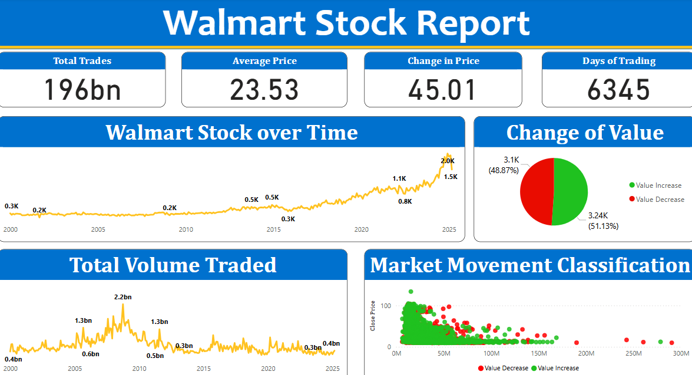

# 📈 Walmart Stock Price Prediction (2025)

A complete end-to-end data science project to predict Walmart's next-day **adjusted close price** using historical stock data. Built with a modular pipeline, regression modeling, and automated feature selection to achieve high predictive accuracy.

---

## 🚀 Project Overview

This project analyzes and models Walmart’s stock performance using publicly available Kaggle data. The goal is to forecast the next day's adjusted close price and identify if the stock price will increase or decrease.

The solution uses:
- Feature engineering from historical pricing data
- Data transformation and scaling
- Outlier detection
- Automated feature selection
- Model training and hyperparameter tuning
- Evaluation using multiple metrics
- A PyTorch-based deep learning classification experiment

---

## 📂 Dataset

- **Source**: [Walmart Stock Data - Kaggle](https://www.kaggle.com/datasets/abdmoiz/walmart-stock-data-2025)
- **Attributes**: `open`, `high`, `low`, `close`, `adj_close`, `volume`, and `date`
- **Timeframe**: Covers data from ~2008 to 2025

---

## 🧪 Workflow

### 1. 📊 Exploratory Data Analysis (EDA)
- Power BI dashboard for visual insight into trends, volatility, and volume patterns.
- Identified phases of Walmart stock prices: early, mid, and recent high growth.

### 2. 🧼 Data Preprocessing
- Parsed datetime features: `year`, `month`, `day`
- Derived columns like `Price_Change`, `pct_change`, and `volatility`

### 3. 🏗 Feature Engineering
- Created time-aware features: `prev_adj_close`, `5_day_ma`, `return_1d`, `ma_7d`, etc.
- Added ratio and rolling statistics for richer modeling context

### 4. ⚖️ Data Transformation
- Log-transformed skewed distributions (prices, volume, volatility)
- Standardized all features using `StandardScaler`

### 5. 🚨 Outlier Handling
- Detected outliers via IQR method
- Opted **not** to drop them (would remove ~20% of data)

### 6. 🔁 Pipeline Automation
- Wrapped all transformation logic into a class: `WalmartStockPipeline`
- ETL process ensures reproducibility and scalability

### 7. ✨ Feature Selection
- Combined:
  - Mutual Information Regression
  - Recursive Feature Elimination (RFE)
  - Permutation Importance
- Selected top features based on a weighted score

### 8. 🤖 Model Training & Tuning
- Models tested: `LinearRegression`, `Ridge`, `Lasso`, `RandomForest`, `GradientBoosting`, `XGBoost`
- Automated hyperparameter tuning with `GridSearchCV`

---

## 🏆 Results

**Best Model**: `LinearRegression`  
**Performance:**
- ✅ R² Score: **0.9966**
- 📉 MAE: **0.5681**
- 📉 RMSE: **0.8657**

Model is saved using `joblib` and ready for deployment.

---

## 🧠 Deep Learning Experiment (Optional)

Tried a PyTorch-based binary classifier to predict if price will **increase** or **decrease** the next day:
- Added BatchNorm, Dropout, and tested multiple optimizers
- Final accuracy plateaued at ~**60%**
- Ultimately commented out from production due to underperformance

---

## 🧰 Technologies Used

- Python (Pandas, NumPy, Matplotlib, Seaborn, Scikit-learn)
- PyTorch (Neural Network experimentation)
- Power BI (EDA visualization)
- KaggleHub (dataset download)
- Joblib (model persistence)
- Colab (development environment)

---

## 📎 Screenshot (Power BI Dashboard)

---

## 🔮 Future Improvements

- Implement LSTM or Transformer-based sequence models
- Integrate live stock feeds for real-time prediction
- Add Streamlit or FastAPI app to visualize predictions

---

## 🙌 Acknowledgments

Thanks to Kaggle for providing the dataset, and to the UNT Data Science course for the project structure inspiration.

---

## 📌 Author

**Houston Parker**  
Student at the University of North Texas  
Focused on applied machine learning, automation, and scalable data science workflows.

